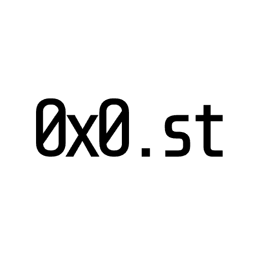

     
     
    
    <h3>0x0</h3>
    
Raycast extension for the 0x0.st file sharing service

     
     

Raycast extension for the [0x0.st](https://0x0.st) file sharing service. Upload files from your machine and get a shareable link in seconds.

In its current form, the extension is meant for simple and quick file sharing with no extended 0x0 features.

## Features

### Upload File

Pick a file from your machine and upload it to your configured 0x0 instance.

- File picker for selecting a single file
- Upload progress toast while the request is in flight
- On success, the shareable URL is copied to your clipboard automatically
- Success toast includes an **Open in Browser** action
- Upload is saved to local history with metadata (filename, URL, management token, expiration)

### Upload History

Browse and manage files you have uploaded through this extension.

- Searchable list of past uploads, sorted newest first
- **Open in Browser** and **Copy Link** for any entry
- **Delete File** — permanently removes the file from the server when a management token was stored at upload time
- **Remove from History** — removes the entry locally without touching the remote file
- **Clear All History** — wipes local history; remote files are not deleted
- Expired entries are removed automatically when history is loaded
- Visual indicators for expiration time and entries missing a management token (remote delete unavailable)

### Self-hosted instances

In extension preferences, set a custom **Instance URL** to point at any 0x0-compatible server — including a local instance. Defaults to `https://0x0.st`.

## Commands

| Command            | Description                                  |
| ------------------ | -------------------------------------------- |
| **Upload File**    | Select a file and upload it to 0x0.st        |
| **Upload History** | Browse, open, and delete your uploaded files |

## Credits

Special thanks to the amazing contributors behind 0x0. You can view their repo [here at mia/0x0](https://git.0x0.st/mia/0x0).

Created by [pseudobun](https://github.com/pseudobun).

Contributed by [pernielsentikaer](https://github.com/pernielsentikaer), [jatindotdev](https://github.com/jatindotdev), and [0xdhrv](https://github.com/0xdhrv).
