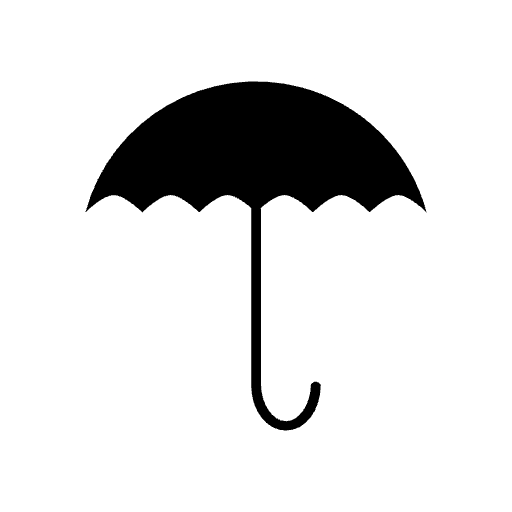

    

# deSEC

This is a Raycast extension for deSEC (https://desec.io/) - _Free Secure DNS_.

## 🚀 Getting Started

1. **Install extension**: Click the `Install Extension` button in the top right of [this page](https://www.raycast.com/xmok/desec) OR `install` via Raycast Store

    

2. **Enter your Token**: The first time you use the extension, you'll need to enter your 'deSEC' Token:

    a. `Navigate` to [TOKEN MANAGEMENT](https://desec.io/tokens)

    b. `Click` the "+" icon

    c. `Choose` desired settings

    d. `Click` "SAVE"

    e. `Copy` the shown value

    f. `Paste` in **Preferences** OR at first prompt

## ➕ More

Using another service for **DNS**? Try these:

