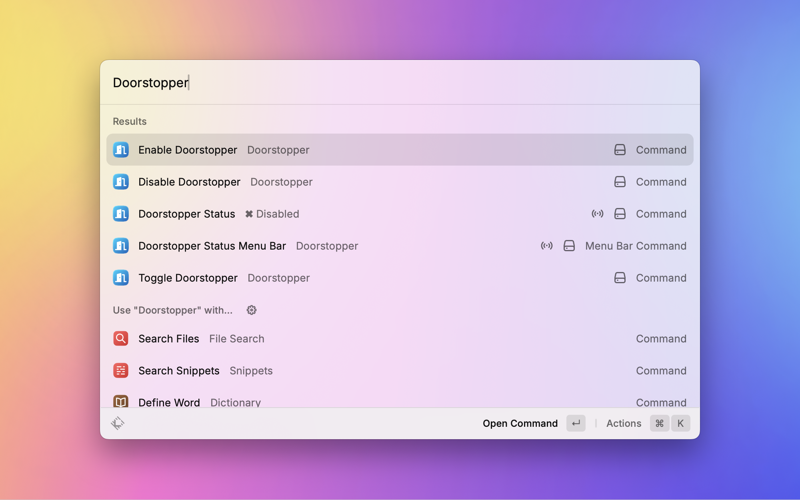

<p align="center">
  
  <h1 align="center">Doorstopper Extension</h1>
</p>

Doorstopper is a Raycast extension which prevents your MacBook from going to sleep when you close the lid.

> **Note:**  
> The underlying commands need to be run with `sudo` privileges.  
> The extension will prompt you for your password by default.

## Authenticate with Touch ID

Doorstopper can use Touch ID instead of a password when Touch ID authentication is enabled for `sudo`. This changes `sudo` authentication globally, not just within Raycast.

### macOS Sonoma (14) and Later

1. Copy `/etc/pam.d/sudo_local.template` to `/etc/pam.d/sudo_local`:
   ```bash
   sudo cp /etc/pam.d/sudo_local.template /etc/pam.d/sudo_local
   ```
2. Uncomment the following line in `/etc/pam.d/sudo_local`:
   ```text
   auth       sufficient     pam_tid.so
   ```

### macOS Ventura (13) and Earlier

Add the following line to the `auth` entries in `/etc/pam.d/sudo`:

```text
auth       sufficient     pam_tid.so
```

Changes to `/etc/pam.d/sudo` can be overwritten by macOS updates. If Touch ID is unavailable or not enabled for `sudo`, Doorstopper will continue to use the administrator password prompt.

## Installation 🛠️

To install the Doorstopper extension, follow these steps:

1. Open Raycast.
2. Search for "Store" and navigate to the Raycast Store.
3. Search for "Doorstopper" and click "Install."

## Usage 🚀

Once installed, simply trigger the Raycast command palette and search for the Doorstopper commands.

<p align="center">
  
</p>

## Features ✨

### 1. `Enable Doorstopper`

This command will enable Doorstopper, preventing your MacBook from sleeping when the lid is closed.

### 2. `Disable Doorstopper`

This command will disable Doorstopper, allowing your MacBook to sleep when the lid is closed.

### 3. `Toggle Doorstopper`

This command will toggle the Doorstopper status between enabled and disabled.

### 4. `Doorstopper Status`

This command will show the current status of Doorstopper (enabled or disabled).

### 5. `Doorstopper Status Menu Bar`

This command will show the current status of Doorstopper in the menu bar.
