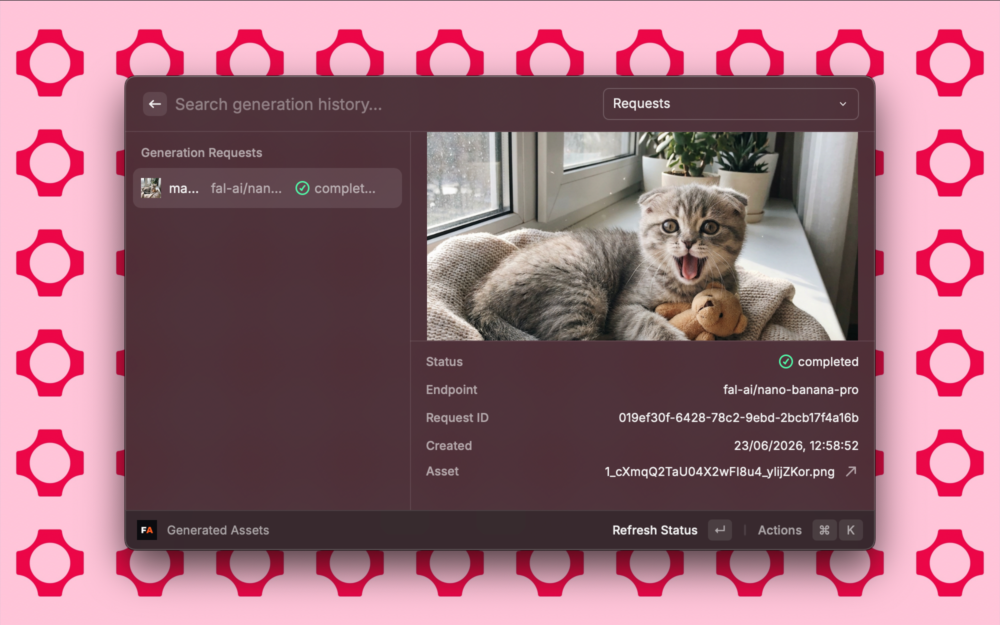
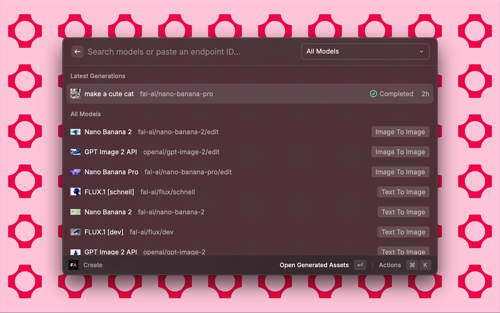
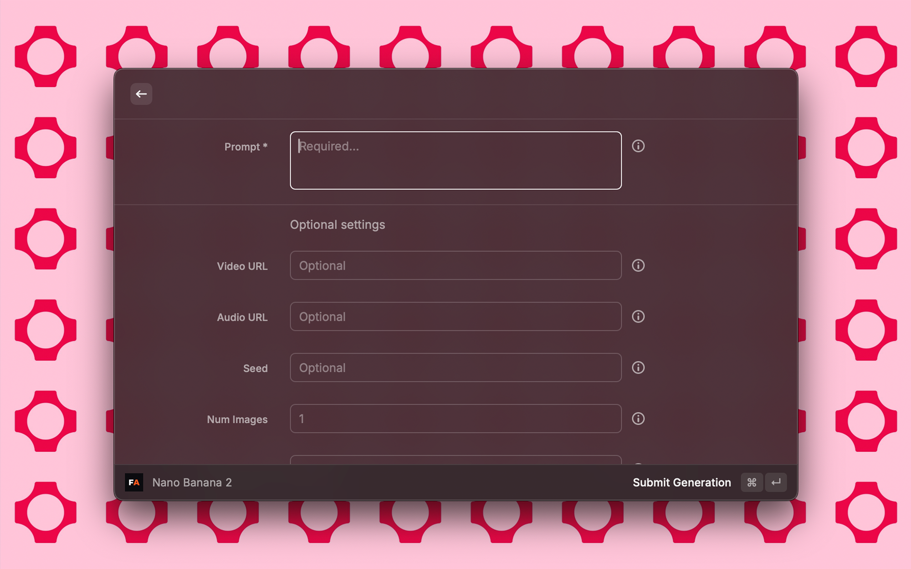
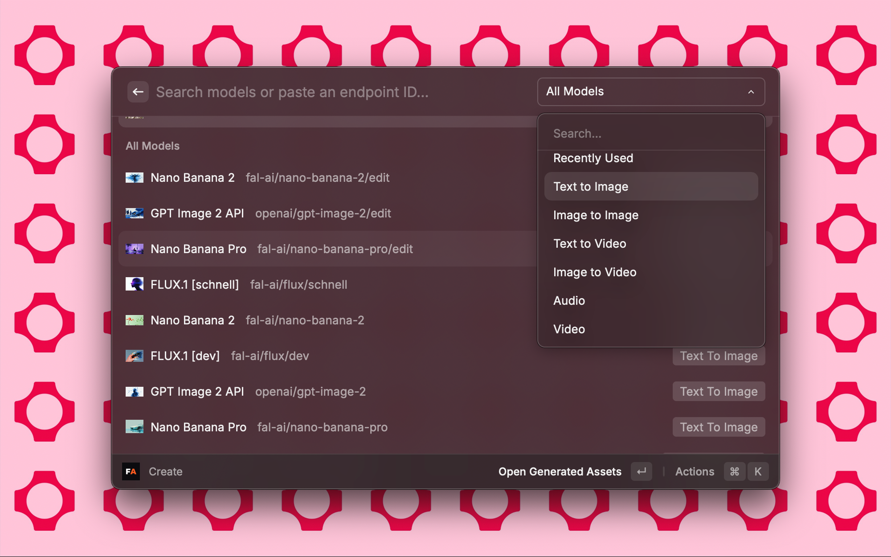

# fal.ai Raycast Extension

Create and retrieve media from fal.ai models directly in Raycast.

## Setup

1. Create a fal API key at https://fal.ai/dashboard/keys.
2. Open Raycast Preferences, select the **fal.ai** extension, and paste the key into **fal API Key**.
3. Run **Create** to search models and submit generation requests.

Raycast stores the API key as a password preference. The extension sends prompts, model parameters, and referenced input URLs to fal.ai when you submit a generation.

## Commands

### Create

Search fal.ai models, filter by model type, and open a schema-derived generation form. The command supports favorites, recently used models, manual endpoint IDs, and raw JSON overrides for advanced model parameters.

### Generated Assets

View local generation history and fal Assets. You can refresh queued requests, preview generated images, open asset links, copy result JSON, copy asset URLs, or download assets to your Downloads folder.

## Screenshots

The Raycast Store metadata includes these screenshots:

1. 
2. 
3. 
4. 

## Notes

- fal.ai usage may require billing or credits depending on the model.
- Long-running generations are submitted through fal's async queue and saved in Raycast local storage.
- Some models expose nested or model-specific parameters. Use **Raw JSON Overrides** when a field cannot be represented cleanly in the generated form.
- If a request is still queued or running, open **Generated Assets** and use **Refresh Status**.
