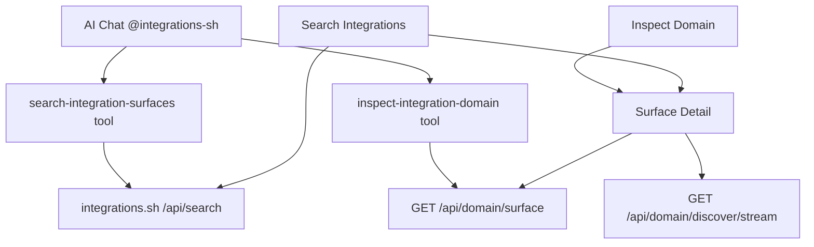

# integrations.sh

     
     
    
    <h3>integrations.sh</h3>
    
Search and inspect integration surfaces from integrations.sh

     
     

Search and inspect integration surfaces from [integrations.sh](https://integrations.sh) — a registry of MCP, REST/OpenAPI, GraphQL, and CLI integrations mapped to their credentials and setup instructions.

No authentication required.

## Commands

### Search Integrations

Search the catalog by domain, service, or integration type. Filter results by surface kind (MCP, OpenAPI, GraphQL, CLI) and:

- Inspect surfaces and credentials inside Raycast
- Open the domain page on integrations.sh
- Copy the domain, surface API URL, or domain page URL

### Inspect Integration Domain

Pass a domain (e.g. `stripe.com`) to jump straight into a detail view of its surfaces, auth status, and credential setup guides. From there you can also run a fresh discovery pass.

## AI Extension

Use `@integrations-sh` in Raycast AI Chat or open the "Ask Integrations.sh" item from root search to ask natural-language questions about integration surfaces.

The AI extension can:

- Search integrations.sh by domain, service, product, or surface kind
- Inspect a specific domain's surfaces, auth status, and credential setup instructions
- Return useful integrations.sh links for follow-up inspection

## Data source

All data comes from the public `integrations.sh` API:

- `GET /api/search` — catalog search
- `GET /api/{domain}/surface` — stored/baseline surface document
- `GET /api/{domain}/discover` — full discovery (rate-limited; used only for "Run Fresh Discovery")

