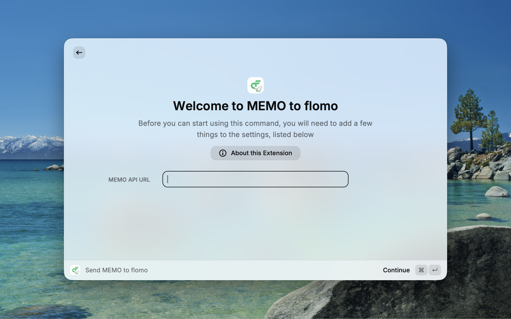
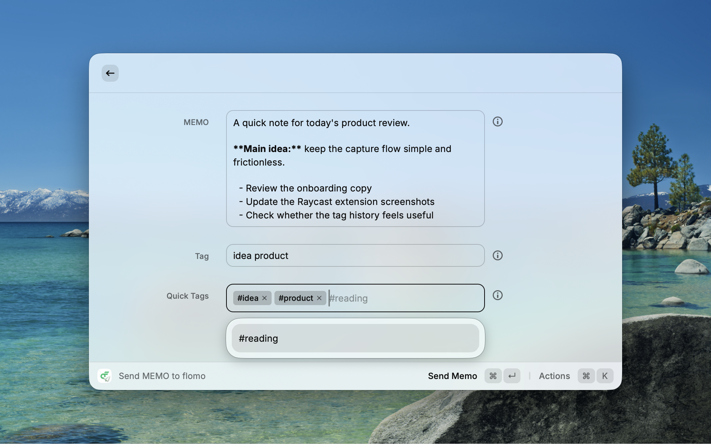

# MEMO to flomo

MEMO to flomo is a Raycast extension for quickly sending notes to flomo.

Open Raycast, write a memo, add tags if needed, and send it directly to your flomo account.

## What It Does

- Send quick memos to flomo from Raycast.
- Write memos with Markdown formatting.
- Add flomo tags before sending.
- Reuse recently used tags from tag history.

## Screenshots





## Setup

Before using the extension, add your flomo MEMO API URL.

1. Open flomo settings and find your MEMO API URL. See the [official flomo API guide](https://help.flomoapp.com/advance/api.html) for details.
2. Open this extension's preferences in Raycast.
3. Paste the URL into `MEMO API URL`.

After setup, the extension is ready to send memos to flomo.

## How to Use

1. Open `Send MEMO to flomo` in Raycast.
2. Write your memo in the `MEMO` field.
3. Add tags in `Tag` if needed. Separate multiple tags with spaces.
4. Press `Command + Enter` to send.

## Tags

Tags can be typed with or without `#`. The extension will format them for flomo automatically.

These inputs are equivalent:

```text
reading work
#reading #work
reading #work
```

They will be sent as:

```text
#reading #work
```

Recently used tags appear in `Quick Tags`, so you can select them again next time. To remove saved tag history, choose `Clear Tag History` from the action panel.
