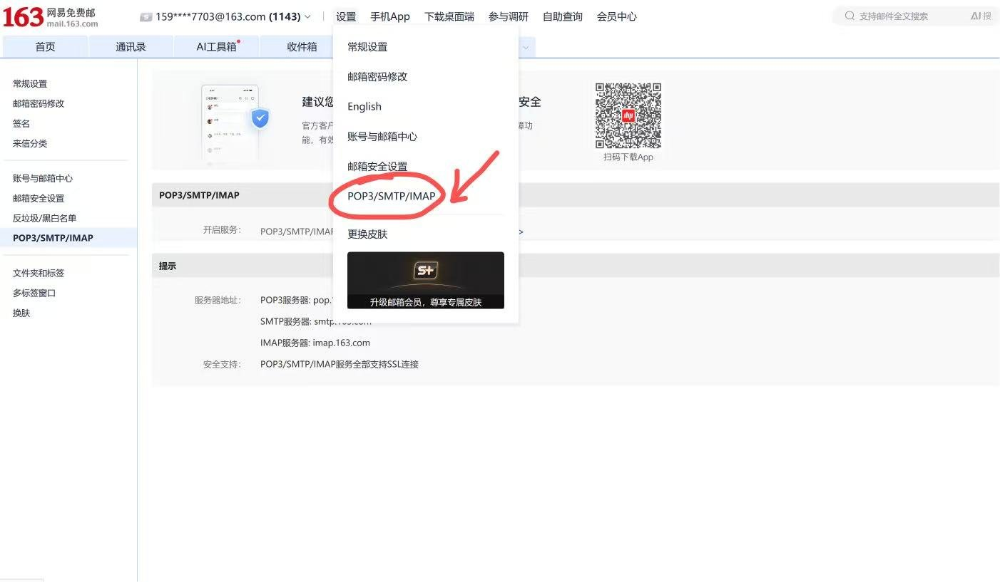
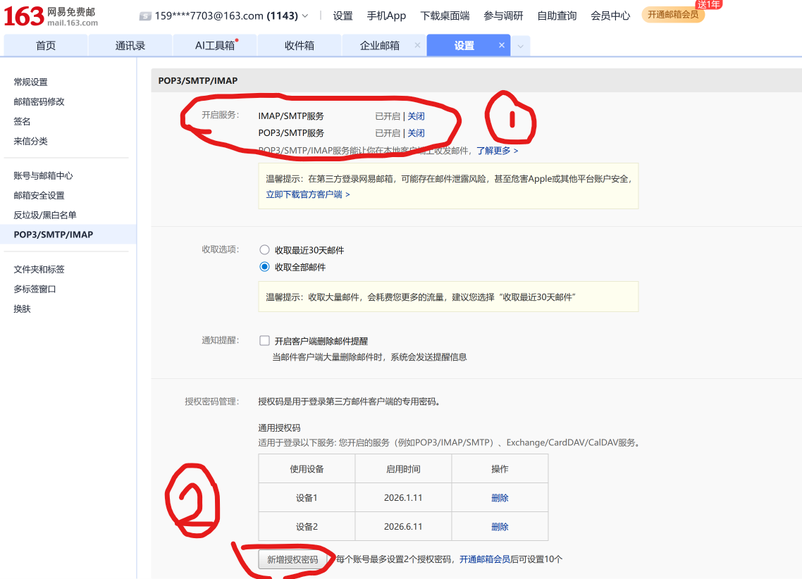

# NetEase Mail

Read, search, extract verification codes, and send NetEase Mail directly from Raycast.

## Features

- **Inbox** - Browse recent inbox or unread messages with sender, subject, date, and preview text
- **Mail Search** - Search recent messages by subject, sender, recipient, and readable body text
- **Verification Code Extraction** - Find recent 4-8 digit verification codes and login links, then copy them in one action
- **Compose Mail** - Send plain-text email through SMTP
- **Templates** - Use built-in quick replies and save your current compose draft as a reusable local template
- **Setup Guide** - Follow a first-run guide for enabling NetEase Mail IMAP/SMTP and creating an authorization code

## Setup

1. On a computer, log in to [NetEase Mail](https://mail.163.com/) in your browser.
2. Click **设置** in the top navigation.
3. Click **POP3/SMTP/IMAP**.

4. Turn on both **IMAP/SMTP服务** and **POP3/SMTP服务**.
5. In **授权密码管理**, click **新增授权密码**.

6. Copy the generated authorization password into **Authorization Code** in Raycast preferences.
7. Open the extension preferences in Raycast and fill in:
   - **Email Address**: for example `name@163.com`
   - **Authorization Code**: the client authorization code from NetEase Mail settings
   - **IMAP Host / Port**
   - **SMTP Host / Port**

Keep the other options unchanged unless your mailbox uses a different NetEase domain.

Common server settings:

| Mailbox | IMAP | SMTP |
| --- | --- | --- |
| `163.com` | `imap.163.com:993` | `smtp.163.com:465` |
| `126.com` | `imap.126.com:993` | `smtp.126.com:465` |
| `yeah.net` | `imap.yeah.net:993` | `smtp.yeah.net:465` |

## Commands

- **Setup Guide**: Learn how to enable IMAP/SMTP and create an authorization code.
- **Inbox**: View recent or unread mail, open details, mark as read, copy a summary, or open NetEase web mail.
- **Search Mail**: Search recent mail by keyword across subject, sender, recipient, and readable body text.
- **Extract Verification Code**: Scan recent messages for verification codes and login links.
- **Compose Mail**: Send email through SMTP and save reusable local templates.

## Notes

- This extension currently supports one account at a time.
- NetEase authorization codes are usually displayed once. Generate a new one if you lose it.
- Message bodies are converted to readable plain text before being shown in Raycast.
