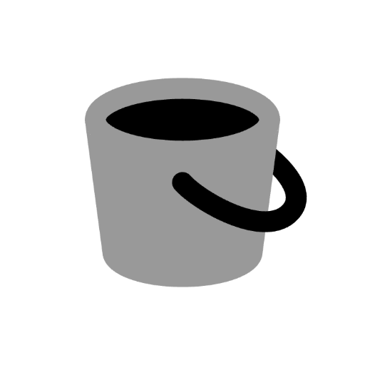

     
     
    
    <h3>paste.rs</h3>
    
Create quick anonymous paste.rs links from your clipboard or typed text

     
     

Create quick anonymous [paste.rs](https://paste.rs) links from your clipboard or typed text.

paste.rs is intentionally minimal: anonymous, no API key, no account. This extension keeps that spirit — upload text, get a URL back on your clipboard.

## Commands

- **Create Paste** — Open a form, type or paste content, submit, and the paste URL is copied to your clipboard.
- **Paste Clipboard** — Upload whatever text is on your clipboard and copy the resulting URL.
- **Recent Pastes** — Browse pastes you created with Raycast. Copy the URL or the original content back, open the paste in your browser, delete a paste on paste.rs, or just remove it from your local history.

## Notes

- Pastes are anonymous and public. Don't paste secrets.
- paste.rs enforces a maximum upload size. If your content exceeds it, only part is stored and you'll be warned that the paste was partially uploaded (`206 Partial Content`).
- **Recent Pastes** history is stored locally on your machine (the last 50 pastes). paste.rs has no listing endpoint, so the history only reflects pastes made through Raycast.
- **Delete Paste** issues a `DELETE` to paste.rs and removes the entry from history. **Clear History** only clears the local list and leaves the pastes on paste.rs.
