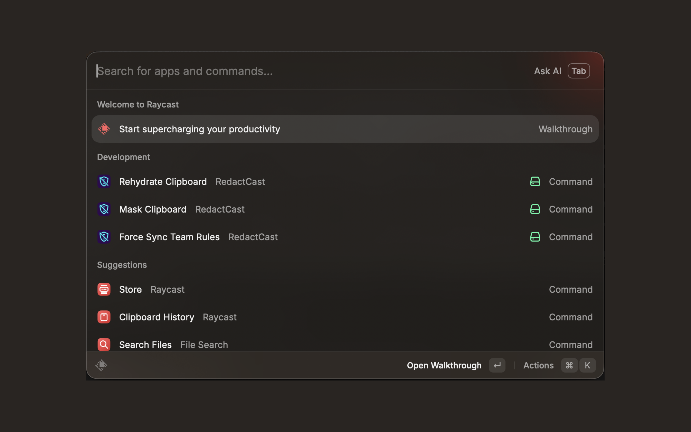
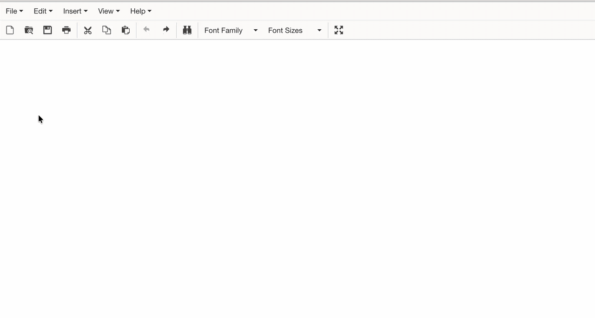
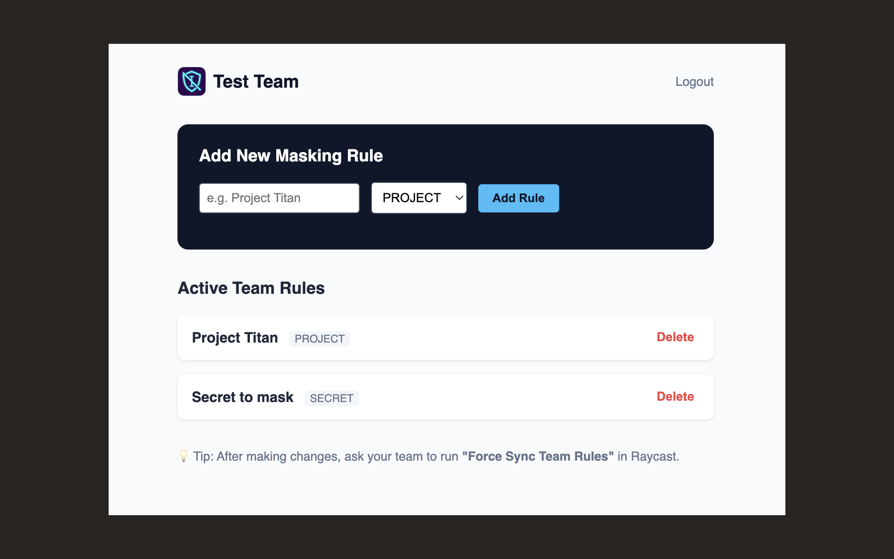

# RedactCast

  

A fast, local-first PII masker for developers and power users of AI tools (ChatGPT, Claude, Cursor).

RedactCast sanitizes sensitive data in your clipboard before you paste it into an LLM. When the AI responds, hit the reverse hotkey to restore your original data — using a deterministic, reversible token mapping.

  

### Why RedactCast?

Standard "scrubbing" tools destroy your data (e.g. replacing names with "XXX"), making the AI's response unusable in your codebase or emails. RedactCast uses a deterministic, **reversible mapping** (`[EMAIL_1]`, `[PHONE_1]`).

### What it detects

Out of the box, the default rules mask:

- **Email** addresses
- **Phone** numbers
- **IPv4** addresses

Additional terms (internal project names, hostnames, etc.) can be added via a Team key — see below. Review the rules before relying on this for other kinds of sensitive data.

### Privacy

- The mapping table is stored **locally** in Raycast's storage; your original, unredacted data is not uploaded by the extension.
- Only the built-in patterns listed above are matched by default.
- The extension code is open-source, so you can audit exactly what runs on your Mac.

  

### Core Commands (Free)

- **Mask Clipboard**: Scans your clipboard, replaces detected data with tokens, and copies the sanitized text.
- **Rehydrate Clipboard**: Reverses the process, swapping the tokens back to your real data.

### For Teams (RedactCast Pro)

Want to stop your engineering team from pasting "Project Titan" or your AWS hostnames into ChatGPT? With a **RedactCast Pro API Key**, you can define a shared list of terms to mask centrally. Team members enter the API Key in their Raycast preferences, and their local RedactCast automatically syncs and applies your organization's list.

👉 [Get a Team API Key ($15/mo)](https://buy.stripe.com/6oUfZhgtE1nI82lcxu5sA00)
